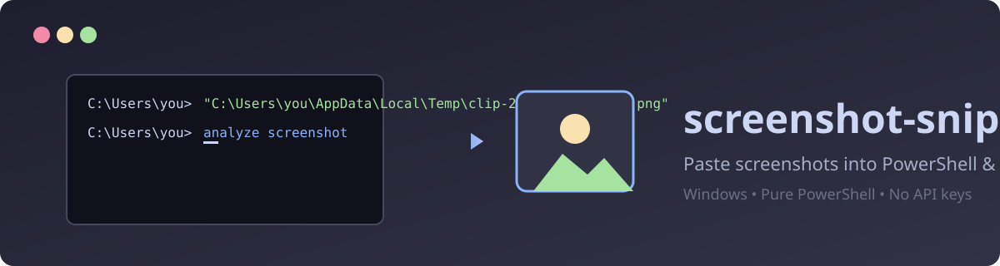
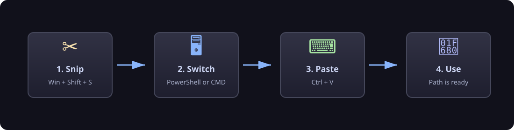
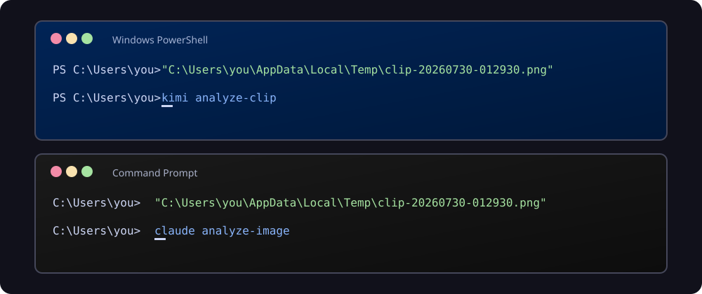

<p align="center">
  
</p>

<h1 align="center">screenshot-snippets</h1>

<p align="center">
  <strong>Paste screenshots into PowerShell, Command Prompt, and Windows Terminal with Ctrl+V.</strong>
</p>

<p align="center">
  
</p>

**Windows-only.** No API keys, no network calls, no third-party dependencies.

When you take a screenshot on Windows with Snipping Tool (`Win+Shift+S`) or
`PrintScreen`, the image lands on your clipboard. Most terminals can't receive
image paste — only text. This tiny PowerShell utility bridges that gap:

1. A background watcher polls the clipboard.
2. When an image appears **and** the foreground window is a terminal, it:
   - Saves the image to a PNG file in your configured output directory.
   - Replaces the clipboard image with the quoted file path as text.
3. Press `Ctrl+V` in the terminal → the path appears. Press Enter and your
   CLI can read the image.

If the foreground window is **not** a terminal (browser, Slack, Discord,
Cursor chat, etc.), the image is left alone so normal image paste keeps working.

## Works in PowerShell and Command Prompt

<p align="center">
  
</p>

Supported terminals:

- ✅ Command Prompt (`cmd.exe`)
- ✅ Windows PowerShell / PowerShell 7 (`pwsh`)
- ✅ Windows Terminal
- ✅ Git Bash / MSYS2 / MinTTY
- ✅ VS Code integrated terminal
- ✅ Cursor terminal
- ✅ ConEmu, WezTerm, Hyper, Alacritty, Tabby

## Install

Clone or download this repo, then run the installer as a normal user:

```powershell
cd screenshot-snippets
powershell -NoProfile -ExecutionPolicy Bypass -File .\install.ps1
```

To change where captures are saved, either:

- Set an environment variable before installing:
  ```powershell
  $env:SCREENSHOT_SNIPPETS_DIR = "$env:USERPROFILE\Pictures\Snips"
  powershell -NoProfile -ExecutionPolicy Bypass -File .\install.ps1
  ```
- Or pass `-OutputDir` directly:
  ```powershell
  powershell -NoProfile -ExecutionPolicy Bypass -File .\install.ps1 -OutputDir "$env:USERPROFILE\Pictures\Snips"
  ```

The installer copies `screenshot-snippets.ps1` to `%USERPROFILE%\.screenshot-snippets`,
creates a hidden launcher, and drops a shortcut in your Windows Startup folder so
it runs every time you log in.

### Start it right now

```powershell
wscript "$env:USERPROFILE\.screenshot-snippets\screenshot-snippets.vbs"
```

## Uninstall

```powershell
powershell -NoProfile -ExecutionPolicy Bypass -File .\uninstall.ps1
```

Add `-DeleteCaptures` to also remove saved PNGs from your temp folder.

## How it works

- `screenshot-snippets.ps1` is the watcher. It P/Invokes `user32.dll` to detect
  the foreground window, polls the clipboard, and swaps images for paths only
  when the active window is a known terminal.
- `install.ps1` copies the watcher to a stable location under your user profile,
  generates a hidden VBS launcher, and registers it in your Startup folder.
- `uninstall.ps1` kills the watcher and removes the installed files.

## Files

| File | Purpose |
|------|---------|
| `screenshot-snippets.ps1` | Clipboard image watcher |
| `install.ps1` | One-time install (Startup shortcut + hidden launcher) |
| `uninstall.ps1` | Remove watcher and startup shortcut |
| `.env.example` | Optional config example |
| `.gitignore` | Ignores logs, captures, and environment files |

## Logs

The watcher writes a log to `%TEMP%\screenshot-snippets.log` for troubleshooting.

## Security / privacy

- No network requests.
- No cloud upload.
- No API keys or credentials.
- Images are saved locally to the configured directory (default: your temp folder).
- Only the active foreground window's process name, window class, and title are
  inspected to decide whether the active app is a terminal.

## Why not AutoHotkey?

AutoHotkey works, but it requires installing a third-party app (often with an
admin/UAC prompt). This version uses only PowerShell 5.1, which ships with
Windows 10/11 out of the box.

## License

MIT — see [LICENSE](./LICENSE).
